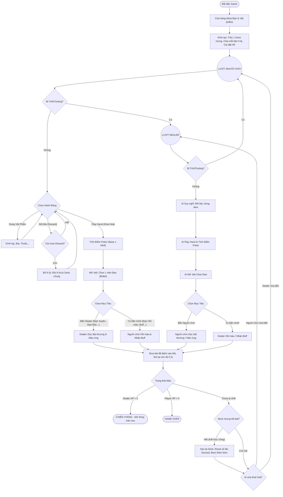

# Sơ đồ Luồng Game (Core Loop)

Sơ đồ này mô tả vòng lặp cốt lõi của game (Core Loop), kết hợp cơ chế Cửa hàng (Shop), Tính điểm (Poker/Balatro) và Bắn súng (Buckshot Roulette). Bạn có thể xem biểu đồ trực quan bằng cách cài extention Mermaid trên VSCode hoặc dán vào [Mermaid Live](https://mermaid.live).

